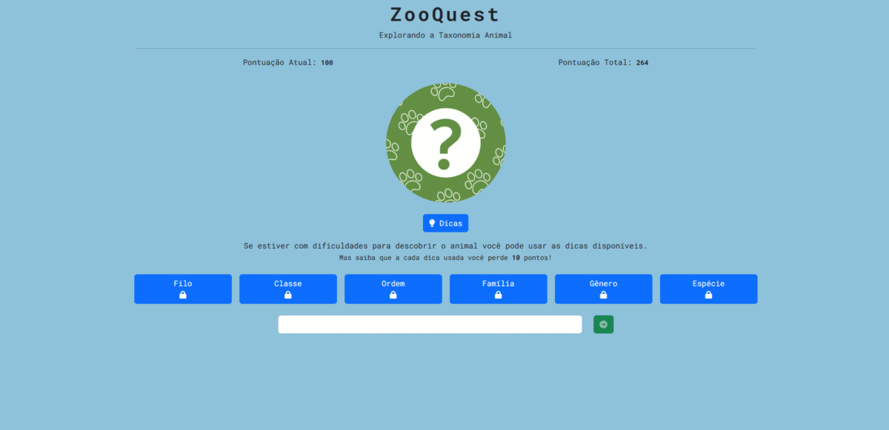

## Apresentação Geral

**Nome do Projeto:** ZooQuest

**Descrição:**

ZooQuest é um jogo web envolvente que desafia os jogadores a testarem seu conhecimento sobre animais de maneira divertida e estimulante. 
Usando pistas de taxonomia, os participantes tentam adivinhar o nome dos animais em um ambiente educativo e cativante. Adequado para 
todas as idades, ZooQuest promove uma experiência divertida e educativa, ideal para amantes da natureza e entusiastas da fauna. A cada 
jogo, os jogadores exploram a incrível diversidade do reino animal e aprendem sobre sua classificação taxonômica. Prepare-se para 
mergulhar neste desafio de trivia animal e conquistar o reino animal no ZooQuest!

**Objetivo:**

Promover o aprendizado divertido e a conscientização sobre a diversidade animal através de desafios de trivia educativos.

**Tecnologias Utilizadas:**

## Contato

